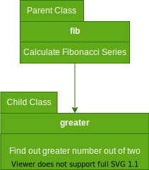
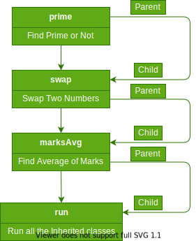
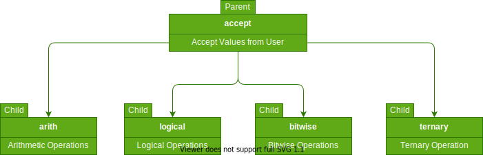

# Index for LEC.11.10.2022
1. [WAP to create two classes one class do the process of fibonacci series and in second class find out the greater between two numbers. From second class display both the operation.](./singleInheritance/)

2. [WAP to create three classes, one class to implement the prime no process , second class to implement the swapping of two no, third class imepelment and find out the average of student marks.](./multiLevelInheritance/)

3. [WAP to accept number from the user and perform the different types of Operator.](./hierarchicalInheritance/)

